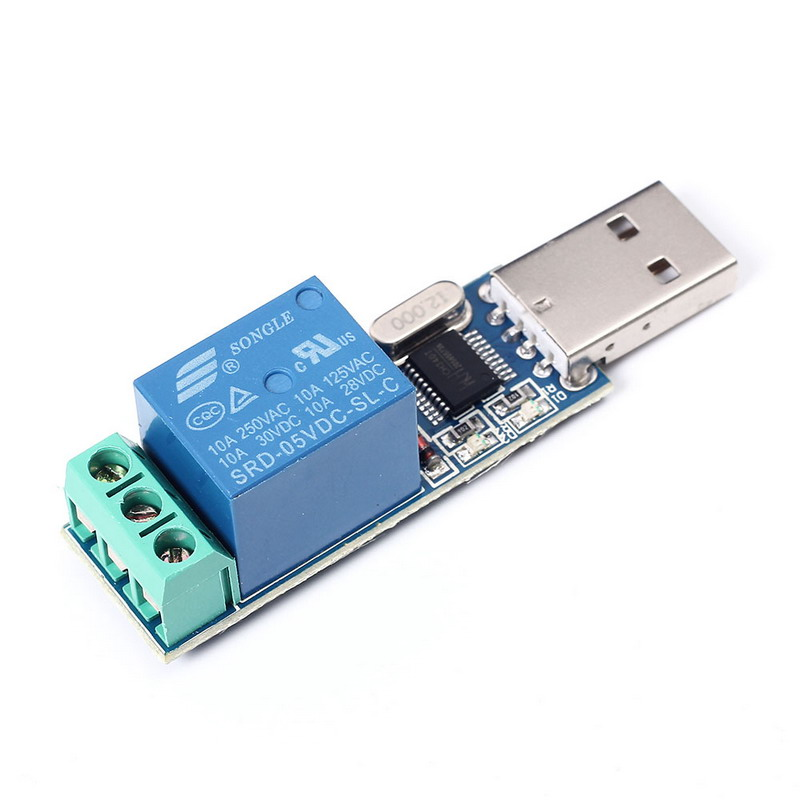

# usb_relay
## Python 3.x code for controlling  a USB CH340 Relay

### Installation

(Connect one end of the cable to NO input and the other to COM).

```sudo chmod 777 /dev/ttyUSB0```

```pip install pyserial```

Note: chmod 0777 is a temporary solution. To give persistent access permissions to /dev/ttyUSB0 to your user you have to find out the gid of /dev/ttyUSB0 by doing:

```stat /dev/ttyUSB0```

and then add our user to that group with:

```sudo gpasswd -a USER group```

Close and login to recharge our user's permissions.

### Running

Seriously?


